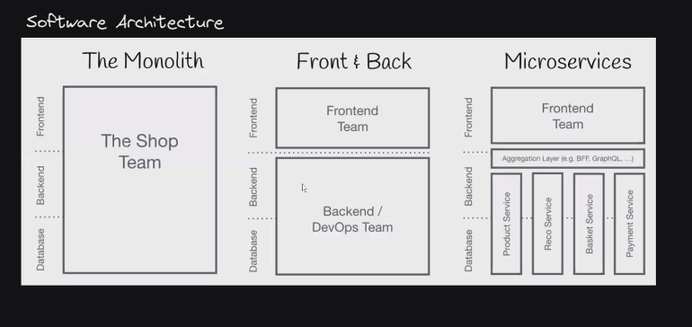

# Web Server

Web server adalah software yang berfungsi menerima dan merespons *request* dari pengguna

## Software Architecture

## Macam - macam software architecture

### Traditional HTML, CSS, dan JS

### Client-Side Renderer

### Server-Side Rendering

## API

API adalah *interface* yang bisa membuat sebuah sistem saling berkomunikasi

## Apa itu REST

REST adalah kepanjangan dari Representational state transfer. REST adalah salah satu arsitektur desain untuk membuat web services

Rules milik REST

1. Uniform interface
2. Client-server
3. Stateless
4. Cacheable
5. Layered system
6. Code on demand

API yang menerapkan rules di atas disebut RESTful API

HTTP Method

- Get
- Post
- Delete
- PUT

Status Code

- 2xx
- 3xx
- 4xx
- 5xx

# Node JS

Node JS berfungsi untuk mengeksekusi kode JavaScript di luar *browser*

## Built-In Module

| Module | Description |
| --- | --- |
| assert | Provides a set of assertion tests |
| buffer | To handle binary data |
| child_process | To run a child process |
| cluster | To split a single Node process into multiple processes |
| crypto | To handle OpenSSL cryptographic functions |
| dgram | Provides implementation of UDP datagram sockets |
| dns | To do DNS lookups and name resolution functions |
| domain | Deprecated. To handle unhandled errors |
| events | To handle events |
| fs | To handle the file system |
| http | To make Node.js act as an HTTP server |
| https | To make Node.js act as an HTTPS server. |
| net | To create servers and clients |
| os | Provides information about the operation system |
| path | To handle file paths |
| punycode | Deprecated. A character encoding scheme |
| querystring | To handle URL query strings |
| readline | To handle readable streams one line at the time |
| stream | To handle streaming data |
| string_decoder | To decode buffer objects into strings |
| timers | To execute a function after a given number of milliseconds |
| tls | To implement TLS and SSL protocols |
| tty | Provides classes used by a text terminal |
| url | To parse URL strings |
| util | To access utility functions |
| v8 | To access information about V8 (the JavaScript engine) |
| vm | To compile JavaScript code in a virtual machine |
| zlib | To compress or decompress files |

## Express JS

Express adalah framework aplikasi web Node.js yang minimal dan fleksibel yang menyediakan serangkaian fitur yang kuat untuk aplikasi web dan seluler.

### Instalasi Express JS

### Hello World, di Express JS

# Database Design

Database atau basis data adalah kumpulan data yang dikelola sedemikian rupa berdasarkan ketentuan tertentu yang saling berhubungan sehingga mudah dalam pengelolaannya

### Kardinalitas

1. One-to-many
2. Many-to-many
3. Many-to-one
4. One-to-one

### ERD

ERD adalah pemodelan data atau sistem dalam database, Fungsi ERD adalah untuk memodelkan struktur dan hubungan antar data yang relatif kompleks. Keberadaan sistem Entity Relationship Diagram sangat penting untuk perusahaan dalam mengelola data yang dimilikinya.

ERD terdiri atas 

1. Entity
2. Atribut
3. Relation
